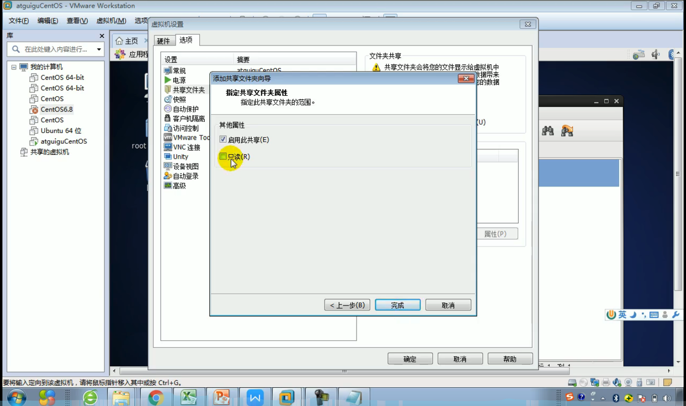

# 5. vmtools的安装和使用

## 5.1 vmtools介绍
vmtools安装后，可以在Windows下更好的管理虚拟机。

* 可以直接粘贴命令在Windows和CentOS系统之间
* 可以设置Windows和CentOS的共享文件夹

## 5.2 vmtools安装

* Step1: 进入CentOS

* Step2: 点击vm菜单 ==> install vmware tools

* Step3: CentOS出现一个vm的安装包

* Step4: 点击右键解压，得到一个安装目录

* Step5: 进入vm解压的目录，该文件在: /root/桌面/vmware-tools-distrib/ 下

* Step6: 安装 ./vmware-install.pl

* Step7: 全部使用默认设置即可

* Step8: 终端输入reboot命令，重新启动，然后生效

## 5.3 设置共享文件夹(d:/share)

`注意`: 在公司的实际开发工程中，文件的上传/下载是需要使用远程方式来完成的。

* Step1: 菜单=>vm=>setting，如图设置即可

`注意:` 设置选项为always enable.

Windows和CentOS可共享d:/share目录可以读写文件了

`说明`: 共享的文件夹在CentOS的 **/mnt/hgfs/** 目录下

