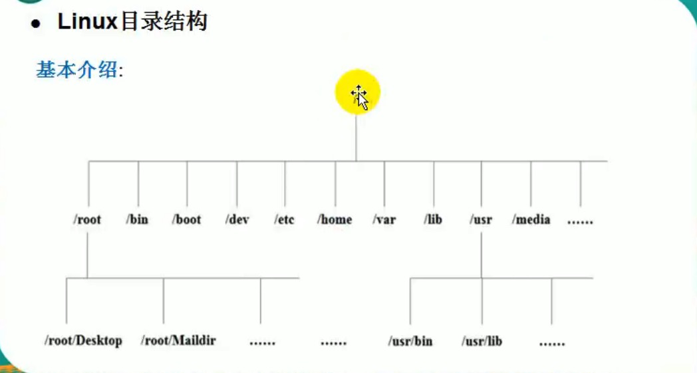

# 6. Linux文件目录系统结构

## 6.1 Linux文件目录介绍
Linux的文件系统是采用层级式的树状目录结构，在此结构的最上层目录是根目录"/"，然后在此目录下再创建其他的目录。

一句经典: 在Linux世界里，一切皆文件。

## 6.2 Linux目录结构

* /bin(/usr/bin、/usr/local/bin): 常用的指令
    * ls
    * chown等

* /sbin: 超级用户、系统管理员能使用的指令

* /root: 系统管理员的主目录

* /home: 家目录，存放普通用户的主目录，创建普通用户时，home就会产生一个用户名同名的文件

---
    
* /etc: 存放配置文件，所有系统管理所需要的配置文件和子目录，如my.conf。

* /lib: 动态库，系统开机所需要的最基本的动态链接共享库，其作用类似于Windows中的DLL文件。几乎所有的应用程序都需要用到这些共享库。

* /lost+found: 这个目录一般是空的，当系统非法关机后，这里就存放了一些文件。

* /usr: 用户目录，用户安装的文件和应用程序，类似于Windows下的program_files目录

---

* /boot: 存放的是Linux启动时使用的一些核心文件，包括一些连接文件以及镜像文件。

* /proc: 这个目录是一个虚拟目录，是系统内存的映射，访问这个目录来获取系统信息。

* /srv: service缩写，存放一些服务启动后需要提取的数据。

* /sys: 系统目录，是Linux2.6内核的一个很大的变化，该目录下安装了2.6内核中出现的一个文件系统sysfs。

* /tmp: 临时目录

---

* /dev: 将所有硬件用文件来存储
    * cpu
    * disk
    * input等

* /media: Linux自动识别的一些设备，如U盘，光驱等，识别后，Linux会把识别的设备挂载到这个目录下。

* /lib64: 库文件夹

* /mnt: 挂载的文件夹，让用户临时挂载别的文件系统的，可以将外部的存储挂载到/mnt/上，然后进入该目录就可以查看里面的内容了。

---

* /opt: 一般放安装的软件，给主机额外安装软件所摆放的目录，默认为空。

* /usr/local: 给另一个主机额外安装软件所安装的目录，一般是通过编译源码方式所安装的程序。

* /selinux: 安全目录，安全子系统，控制程序只能，如果出现安全方面的问题，selinux就会被触发(security-enhanced linux)

* /var: 一般存放日志等，目录存放着不断扩充的东西，习惯性经常被修改的目录放在这个目录下，包括各种日志文件。