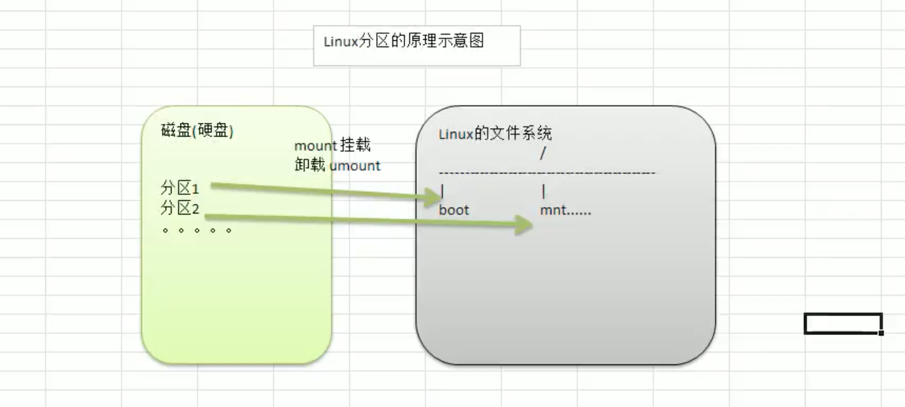
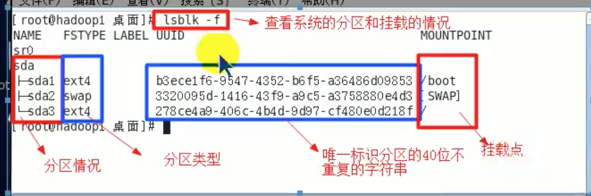

# 3 Linux分区

## 3.1 原理

对Linux来说无论有几个分区，分给哪一目录使用，它归根结底就只有1个根目录，一个独立且唯一的文件结构，Linux中每个分区都是用来组成整个文件系统的一部分。

Linux采用了一种叫"载入"的处理方法，它的整个文件系统中包含了一整套的文件和目录，且将一个分区和目录联系起来。这时要载入的一个分区将使它的存储空间在一个目录下获得。



## 3.2 硬盘

Linux硬盘分 IDE硬盘 和 SCSI硬盘，目前基本上是 SCSI硬盘。

#### IDE 硬盘
对于 IDE硬盘 ，驱动器标识符为 "hdx~"，其中:
* "hd" 表明分区所在的设备类型，这里是指 IDE硬盘
* "x" 为盘号
    * a: 基本盘
    * b: 从属盘
    * c: 辅助主盘
    * d: 辅助从盘
* "~" 代表分区
    * 1-4: 前4个分区，一般为主分区或扩展分区
    * \>=5: 逻辑分区

如:

hda3: 表示第1个IDE硬盘上的第三个主分区或扩展分区

hdb2: 表示第2个IDE硬盘上的第二个主分区或扩展分区

#### SCSI 硬盘
对于 SCSI硬盘，驱动器标识符为 "sdx~"，其中:
* "sd" 表明分区所在的设备类型，这里是指 SCSI硬盘
* "x" 为盘号
    * a: 基本盘
    * b: 从属盘
    * c: 辅助主盘
    * d: 辅助从盘
* "~" 代表分区
    * 1-4: 前4个分区，一般为主分区或扩展分区
    * \>=5: 逻辑分区
    

## 3.3 查看所有设备挂载情况

1.lsblk 或 lsblk -f指令: 查看分区和挂载情况(谐音: 老师不离开)

```
lsblk
lsblk -f
```


如:
```
[root@www ~]# lsblk
NAME   MAJ:MIN RM SIZE RO TYPE MOUNTPOINT
vda    253:0    0  50G  0 disk 
└─vda1 253:1    0  50G  0 part /
```

```
[root@www ~]# lsblk -f
NAME   FSTYPE LABEL UUID                                 MOUNTPOINT
vda                                                      
└─vda1 ext4         eb448abb-3012-4d8d-bcde-94434d586a31 /
```



