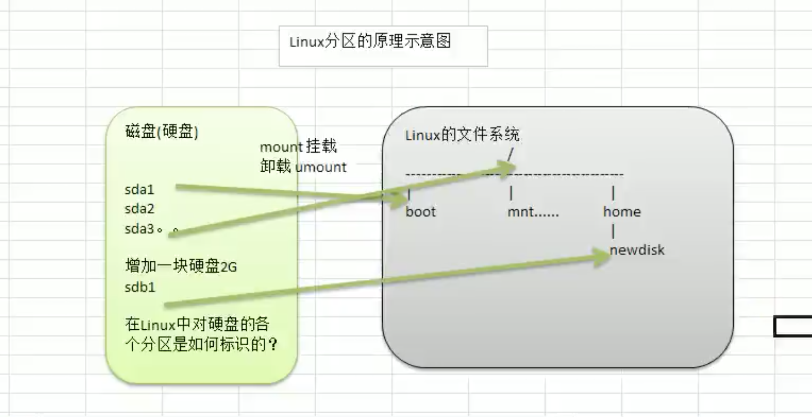
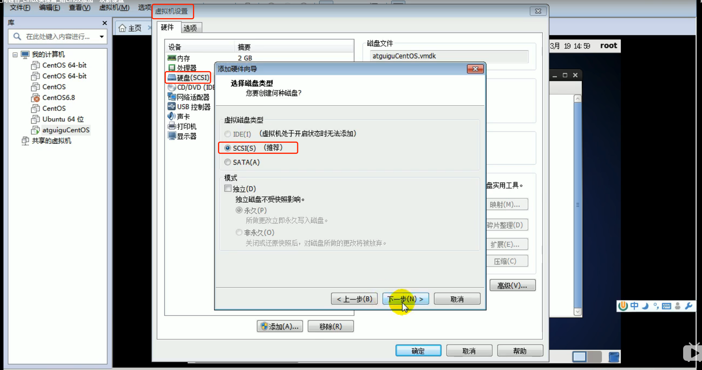
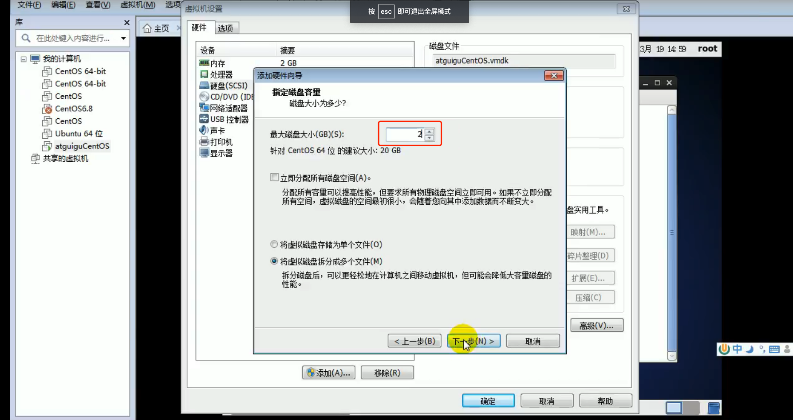
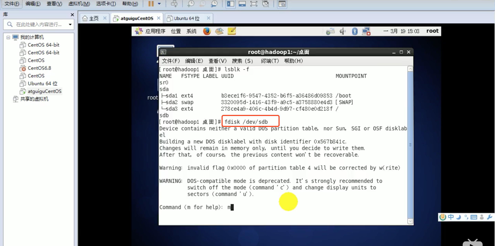
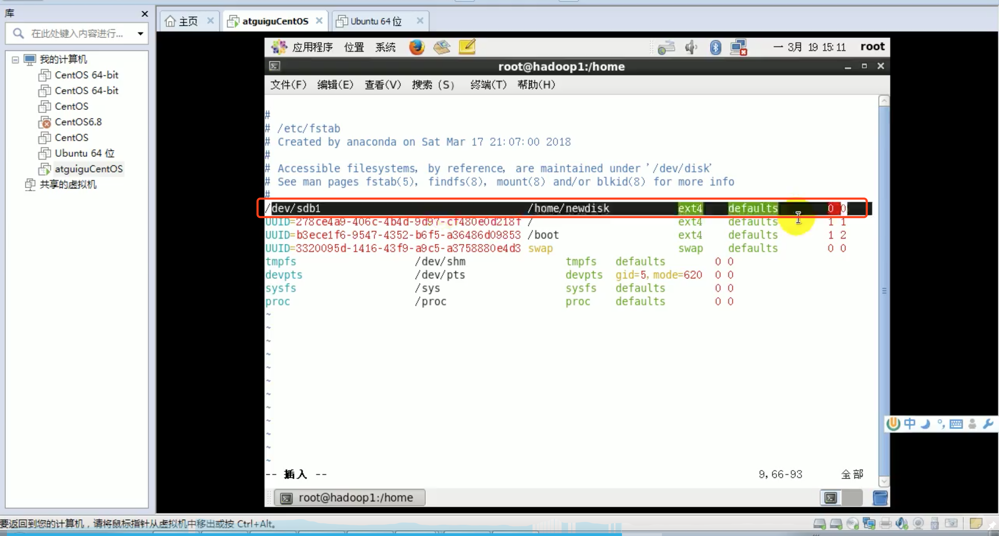

# 4.Linux虚拟机增加一块硬盘
 
 ## 4.1 需求
 
 给Linux系统增加一个新的硬盘，并挂载到 /home/newdisk




## 4.2 如何增加一块硬盘？
* 虚拟机添加硬盘
* 分区
* 格式化
* 挂载
* 设置可以自动挂载


## 4.3 虚拟机添加硬盘






`注意`: 用 lsblk -f 并没有立即生效，需要重启机器生效。


## 4.4 分区
```
fdisk /dev/sdb
```



指令: m ==> n ==> p ==> 1 ==> 1 ==> w

* m: 显示命令列表
* p: 显示磁盘分区，同 fdisk -l
* n: 新增分区
* d: 删除分区
* w: 写入并退出

`说明`: 开始分区后输入n，新增分区，然后选择p，分区类型为主分区。两次回车默认剩余全部空间。最后输入w写入分区并退出，若不退出输入q。


## 4.5 格式化

格式化为: sbk1

```
mkfs -t ext4 /dev/sdb1
```

`说明`: ext4 是分区类型。


## 4.6 挂载

* 先创建1个目录

```
mkdir /home/newdisk
```

* 挂载

挂载: 将一个分区与一个目录联系起来。

```
mount 设备名称 挂载目录
```

如:

```
mount /dev/sdb1 /home/newdisk 
```

```
umount 设备名称 或者 挂载目录
```

如:

```
umount /dev/sdb1
umount /newdisk
```

`注意`: 上述命令是临时挂载。

## 4.7   永久挂载

编辑 /etc/fstab 文件:

```
vi /etc/fstab
```



增加挂载内容:

```
/dev/sdb1    /home/newdisk       ext4     defaults     0  0
```

设置自动挂载:

```
mount -a
```

重启:

```
reboot
```


