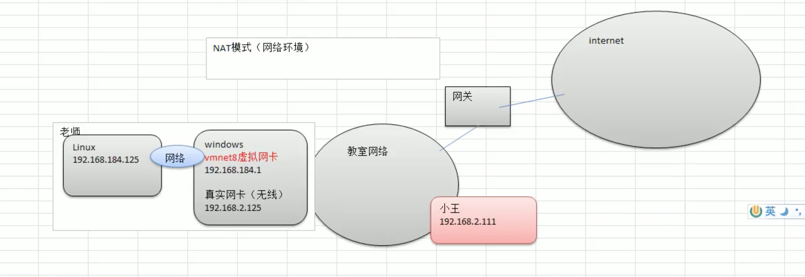

# 1. 网络配置原理

## 1.1 网络配置原理图(含虚拟机)

目前网络配置采用的额是 NAT 。



## 1.2 查看 IP 和 网关

### 查看 IP


### 修改虚拟网卡的IP

上图中的 子网IP 编辑框输入即可。

### 查看网关
虚拟网络设置 ===> NAT设置


### 使用 ifconfig(Linux/Mac OS) 或 ipconfig(Windows) 查看IP和网关

```
ifconfig

ipconfig
```

## 1.3 ping 测试主机之间网络连通性

测试当前服务器是否可以连接目的主机:

```
ping 目的主机
```