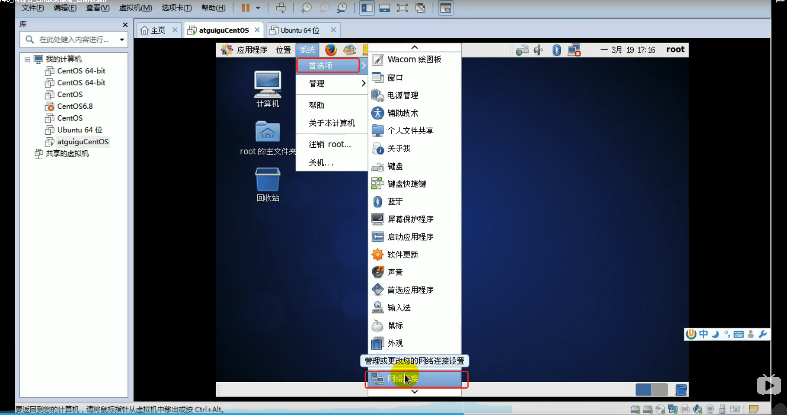
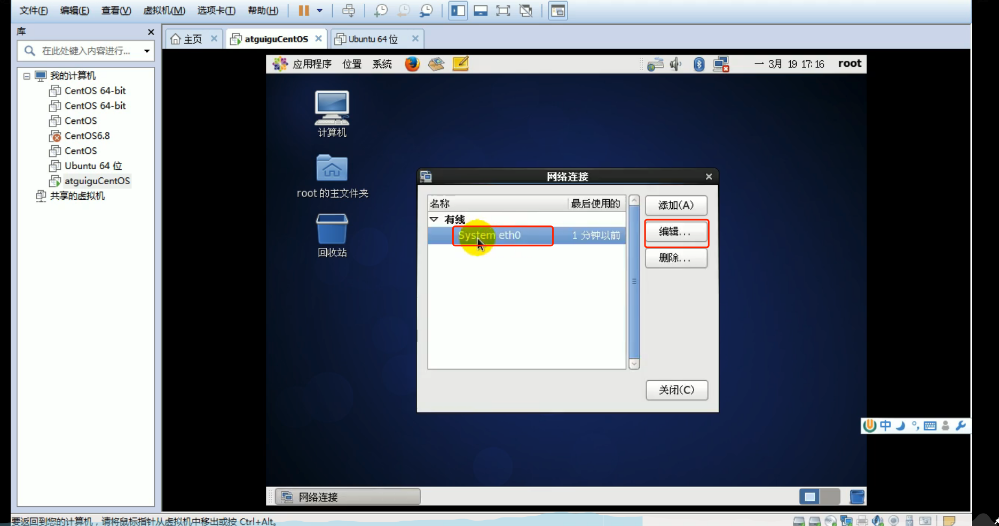
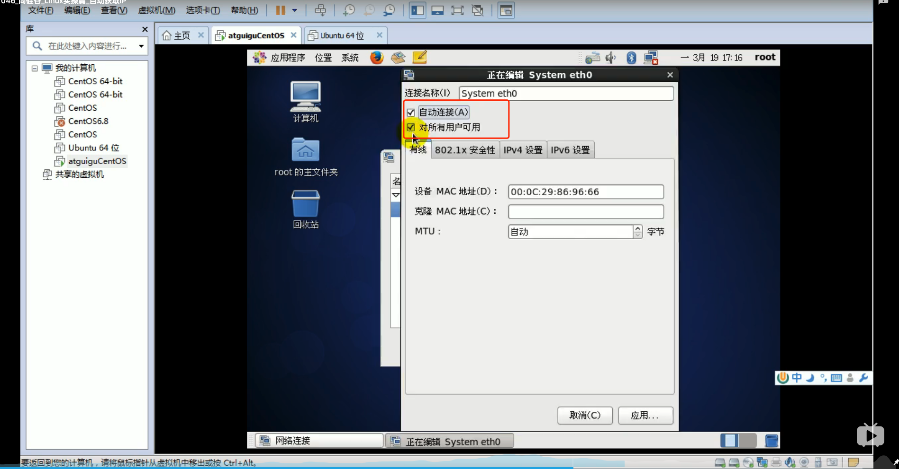
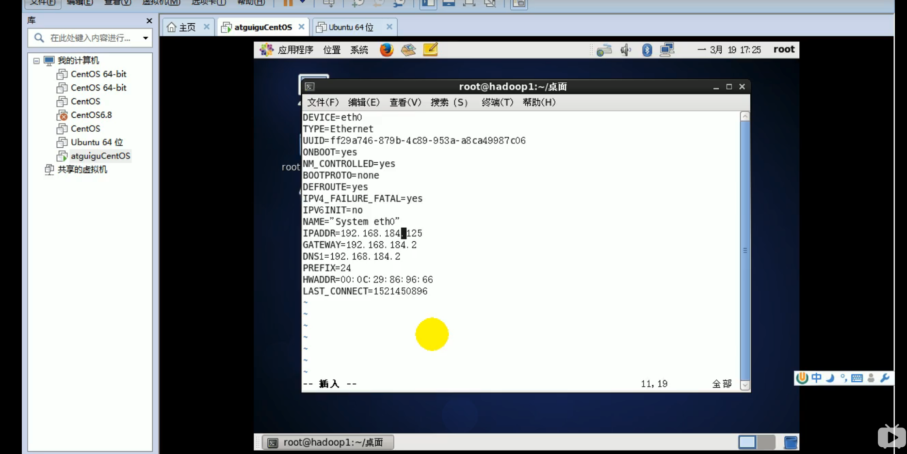
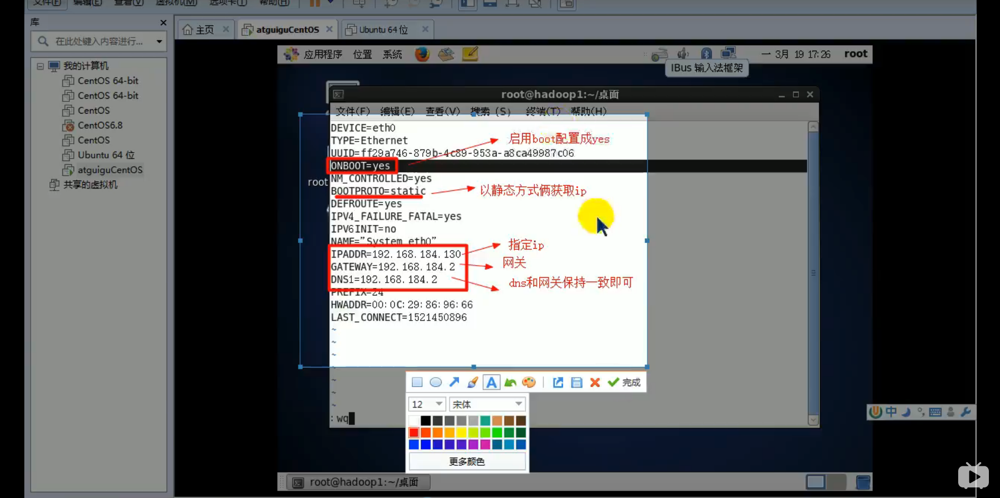

# 2. Linux网络环境配置

## 2.1 自动获取IP

缺点: Linux启动后每次自动获取的IP地址可能不一样。不适用于做服务器。








## 2.2 指定固定的IP

* Step 1: 直接修改文件来指定IP，并可以连接到外网，编辑 /etc/sysconfig/network-scripts/ifcfg-eth0:

将ip地址配置的静态的，ip地址为 192.168.184.130


```shell script
vi /etc/sysconfig/network-scripts/ifcfg-eth0
```

eth0: 代表第1块网卡。

如果有多块网卡，对应eth1,eth2等。


```shell script
DEVICE=eth0 #接口名(设备、网卡)
HWADDER=00:0C:2x:6x:0x:xx #MAC地址
TYPE=Ethernet #网络类型
UUID=9236a784-96c2-4321-basf-abababababab #随机id
#系统启动的时候网络接口是否有效(yes/no)
ONBOOT=yes
#IP配置方法[none|static|bootp|dhcp](引导时不使用协议|静态分配IP|BOOTP协议|DHCP协议)
BOOTPROTO=static
#IP地址
IPADDR=192.168.184.130
#网关
GATEWAY=192.168.184.2
#域名解析器
DNS1=192.168.184.2
```







* Step 2: 重启服务

```shell script
service network restart
```
或

```shell script
reboot
```
