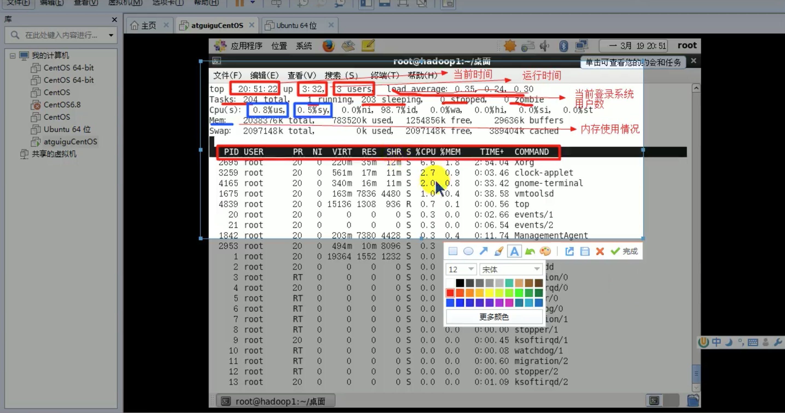
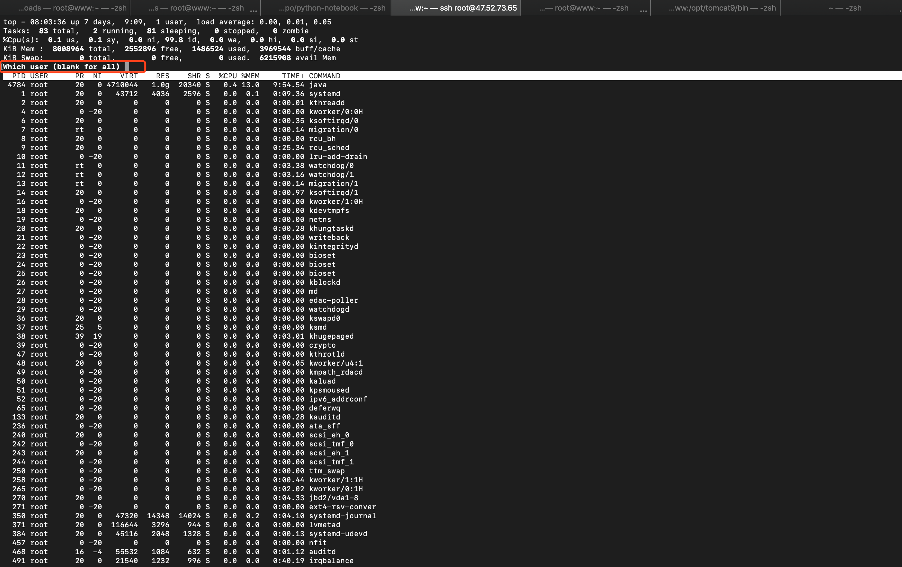
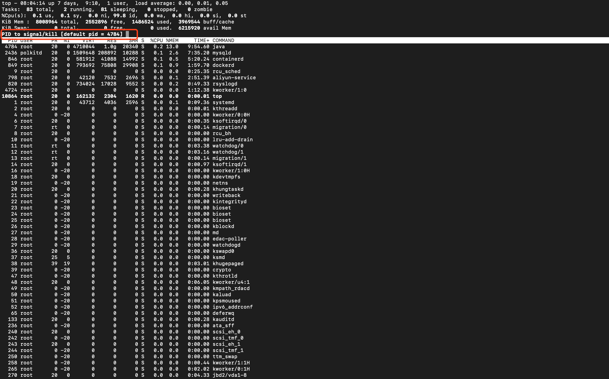
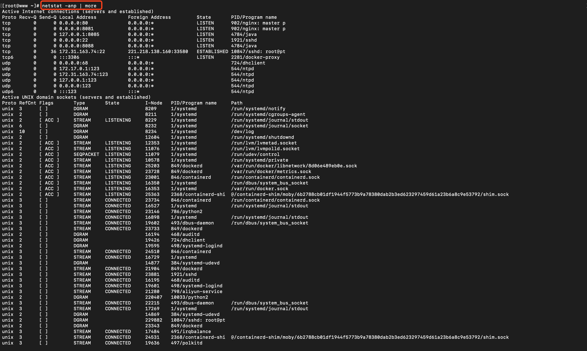

# 7. 监控服务

## 7.1 动态监控进程: top

top 与 ps 指令很相似。它们都用来显示正在执行的进程。

top 与 ps 最大的不同之处: top在执行一段时间后可以更新正在进行的进程。


```
top [选项]
```




### 常用选项
* -d 秒数: 指定top命令每隔几秒更新，默认是3秒
* -i: 使top不显示任何闲置或僵尸进程
* -p: 通过指定监控进程ID来仅仅监控某个进程的状态

### 交互说明
* P: 以CPU使用率排序，默认就是此选项
* M: 以内存的使用率排序
* N: 以PID排序
* q: 退出top


### 案例
1.监视指定用户
```
top
# 输入 u
u
# 再输入用户名
用户名
```


2.终止指定的进程
```
top

# 输入 k
k

# 输入要终止的进程ID号
进程ID号
```


3.指定系统状态更新的时间(每10s)
```
top -d 10
```


## 7.2 监控网络状态: netstat(重要)

查看系统网络情况: netstat

```
netstat [选项]
```

一般:

```
netstat -anp
```




### 常用选项
* -an: 按一定顺序排列输出
* -p: 显示哪个进程在调用

### 案例

查询sshd的网络状态

```
[root@www ~]# netstat -anp | grep sshd
tcp        0      0 0.0.0.0:22              0.0.0.0:*               LISTEN      1921/sshd           
tcp        0     36 172.31.163.74:22        221.218.138.160:33580   ESTABLISHED 10847/sshd: root@pt 
unix  3      [ ]         STREAM     CONNECTED     23881    1921/sshd            
unix  2      [ ]         DGRAM                    229882   10847/sshd: root@pt 
```
 
 
如: 查看服务名为 sshd 的服务信息。


## 7.3 检测主机连接命令: ping

网络检测工具，主要是用于检测远程主机是否正常，或是两部主机间的介质是否为断、网线是否脱落或网卡故障。

```
ping ip地址
```


 
 
