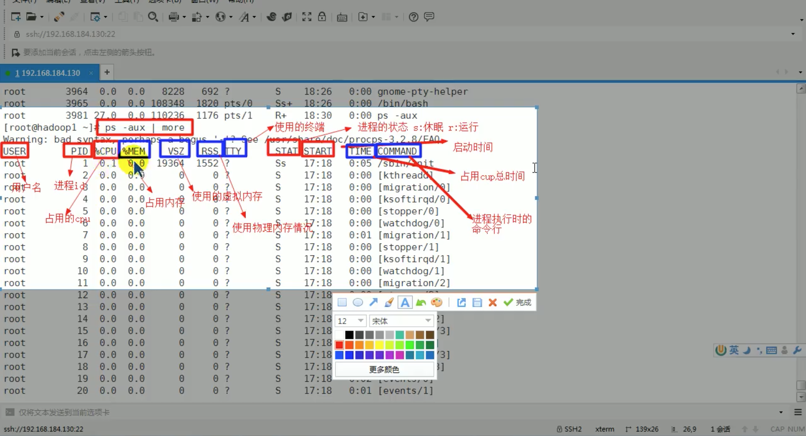

# 2. 查看进程

## 2.1 ps 指令

ps指令是查看目前系统中，有哪些正在执行，以及它们的执行情况，可以不加任何参数。


### 1.查看系统当前的进程
```
ps aux | grep xxx
ps aux | more
```

* -a: 显示当前终端的所有进程信息
* -u: 以用户的格式显示进程信息
* -x: 显示后台进程运行的参数




#### 显示字段说明
* System V: 展示风格
* USER: 用户名称
* PID: 进程号
* %CPU: 进程占用CPU的百分比
* %MEM: 进程占用物理内存的百分比
* VCZ: 进程占用虚拟内存的大小(单位: KB)
* RSS: 进程占用的物理内存的大小(单位: KB)
* TTY: 终端名称，缩写
* STAT: 进程状态
    * S: 睡眠(sleep)
    * s: 该进程是会话的先导进程
    * N: 进程拥有比普通优先级更低的优先级
    * R: 睡眠(running)
    * D: 短期等待
    * Z: 僵尸进程
    * T: 被跟踪或者被停止等等
* STARTED: 进程启动时间
* TIME: 进程使用CPU时间
* COMMAND: 启动进程所用的命令和参数，如果过长会被截断显示


### 2.查看系统当前的进程及父进程

```
ps -ef | grep xxx
ps -ef | more
```

* -e: 显示所有进程
* -f: 全格式

#### 显示字段说明

* BSD风格
* UID: 用户ID
* PID: 进程ID
* PPID: 父进程ID
* C: CPU用于计算执行优先级的因子。
    * 数值越大，表明进程是CPU密集型运算，执行优先级会降低。
    * 数值越小，表名进程是I/O密集型运算，执行优先级会提高
* STIME: 进程启动时间
* TTY: 完整的终端名称
* TIME: CPU时间
* CMD: 启动进程所用的命令和参数


## 2.2 pstree指令

查看进程树，pstree指令

```shell script
pstree [选项]
```

### 常用选项
* -p: 显示进程的PID
* -u: 显示进程所属的用户


## 2.3 pstree应用案例
1.用树状形式显示进程的pid
```shell script
pstree -p
```

2.用树状形式显示进程的用户id
```shell script
pstree -u
```


