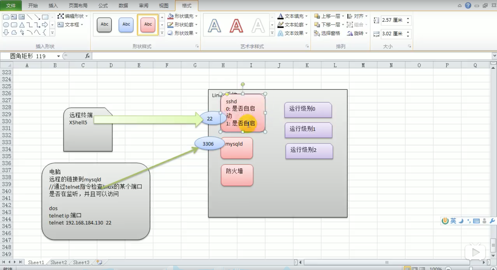

# 6. 设置服务自启动


每个服务的不同运行级别，都可以设置自启动。



## 6.1 chkconfig 指令

chkconfig 命令可以给各个运行级别设置自启动/关闭。

1.查看某个服务
```
chkconfig --list | grep xxx
```

2.指定查看服务名的状态
```
chkconfig 服务名 --list
```

如:

```
[root@www ~]# chkconfig --list

Note: This output shows SysV services only and does not include native
      systemd services. SysV configuration data might be overridden by native
      systemd configuration.

      If you want to list systemd services use 'systemctl list-unit-files'.
      To see services enabled on particular target use
      'systemctl list-dependencies [target]'.

netconsole     	0:off	1:off	2:off	3:off	4:off	5:off	6:off
network        	0:off	1:off	2:on	3:on	4:on	5:on	6:off
```

3.设置某个服务的不同运行级别的自启动 或 关闭
```
chkconfig --level 运行级别数字(0-6) 服务名 on

# 所有级别自启动
chkconfig 服务名 on
 
chkconfig 服务名 off
```

`注意`: chkconfig重新服务自启动或关闭，需要重启机器 reboot 才能生效。


## 6.2 CentOS 7中 systemctl 代替 chkconfig

在CentOS 7中，chkconfig --list 的输出结果只显示 SysV 服务，并不包含原生 systemd 服务。SysV 配置数据可能被原生 systemd 配置覆盖。

1.列出所有可用单元

```
systemctl list-unit-files
systemctl list-unit-files | grep 服务名
```

2.列出所有运行中单元
```
systemctl list-units
systemctl list-units | grep 服务名
```

3.列出所有失败的单元
```
systemctl --failed
systemctl --failed | grep 服务名
```

4.检查某个单元是否启用
```
systemctl is-enabled 服务名
```

5.激活/禁止自动启动
```
systemctl enable 服务名
systemctl disable 服务名
```

