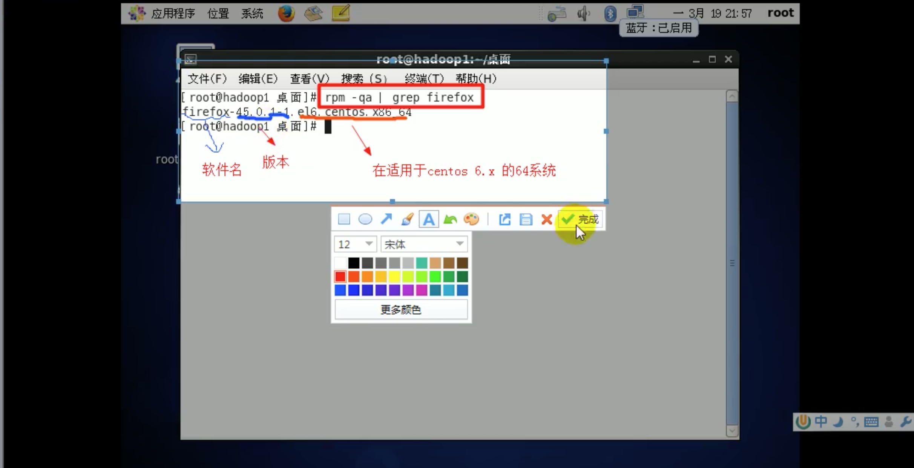

# 1. RPM

## 1.1 RPM包概念
RPM: RedHat Package Manager

RPM是一种用于互联网下载包的打包及安装工具，它包含在某些Linux分发版中。

RPM生成具有.RPM扩展名的文件。类似 Windows 的 setup.exe，这一文件格式名称虽然打上了RedHat的标志，但理念是通用的。

Linux的分发版本都有采用(suse、RedHat、centos等)，算是公认的行内标准了。


## 1.2 RPM查询指令

### 1.查询已安装的rpm列表:

```
rpm -qa | grep xx
```

如:
```
[root@www ~]# rpm -qa | grep firewalld
firewalld-0.6.3-8.el7_8.1.noarch
firewalld-filesystem-0.6.3-8.el7_8.1.noarch
```

### 2.查询所安装的所有rpm软件包
```
rpm -qa
rpm -qa | more
rpm -qa | grep xx
```

如:
```
[root@www ~]# rpm -qa | more
krb5-libs-1.15.1-46.el7.x86_64
libmount-2.23.2-63.el7.x86_64
nss-util-3.44.0-4.el7_7.x86_64
mesa-libgbm-18.3.4-7.el7.x86_64
btrfs-progs-4.9.1-1.el7.x86_64
rpm-build-libs-4.11.3-43.el7.x86_64
readline-6.2-11.el7.x86_64
acl-2.2.51-15.el7.x86_64
cpio-2.11-27.el7.x86_64
perl-macros-5.16.3-295.el7.x86_64
kernel-tools-libs-3.10.0-1127.el7.x86_64
bzip2-libs-1.0.6-13.el7.x86_64
iptables-1.4.21-34.el7.x86_64
```

### 3.查询软件包是否安装
```
rpm -q 软件包名
```

如:
```
[root@www ~]# rpm -q firewalld
firewalld-0.6.3-8.el7_8.1.noarch
```

### 4.查询软件包信息
```
rpm -qi 软件包名
```

如:
```
[root@www ~]# rpm -qi firewalld
Name        : firewalld
Version     : 0.6.3
Release     : 8.el7_8.1
Architecture: noarch
Install Date: Thu 07 May 2020 09:22:24 PM CST
Group       : Unspecified
Size        : 1945832
License     : GPLv2+
Signature   : RSA/SHA256, Wed 08 Apr 2020 10:42:17 PM CST, Key ID 24c6a8a7f4a80eb5
Source RPM  : firewalld-0.6.3-8.el7_8.1.src.rpm
Build Date  : Tue 07 Apr 2020 10:37:19 PM CST
Build Host  : x86-01.bsys.centos.org
Relocations : (not relocatable)
Packager    : CentOS BuildSystem <http://bugs.centos.org>
Vendor      : CentOS
URL         : http://www.firewalld.org
Summary     : A firewall daemon with D-Bus interface providing a dynamic firewall
Description :
firewalld is a firewall service daemon that provides a dynamic customizable
firewall with a D-Bus interface.
```

### 4.查询软件包中的文件
```
rpm -ql 软件包名
```

如:
```
[root@www ~]# rpm -ql firewalld
/etc/dbus-1/system.d/FirewallD.conf
/etc/firewalld
/etc/firewalld/firewalld.conf
/etc/firewalld/helpers
/etc/firewalld/icmptypes
/etc/firewalld/ipsets
/etc/firewalld/lockdown-whitelist.xml
/etc/firewalld/services
/etc/firewalld/zones
/etc/modprobe.d/firewalld-sysctls.conf
/etc/sysconfig/firewalld
/usr/bin/firewall-cmd
/usr/bin/firewall-offline-cmd
/usr/lib/firewalld/helpers/Q.931.xml
/usr/lib/firewalld/helpers/RAS.xml
/usr/lib/firewalld/helpers/amanda.xml
/usr/lib/firewalld/helpers/ftp.xml
/usr/lib/firewalld/helpers/h323.xml
...
```

### 5.查询文件全路径名，查询文件所属的软件包
```
rpm -qf 文件全路径名 
```

如:
```
[root@www ~]# rpm -qf /etc/firewalld
firewalld-0.6.3-8.el7_8.1.noarch
```


## 1.3 RPM包名基本格式


1个RPM包名: firewalld-0.6.3-8.el7_8.1.noarch

* 名称: firewalld
* 版本号: -0.6.3-8
* 适用操作系统: el7_8.1.noarch 适用CentOS 7的通用系
    * el6: CentOS 6
    * el7: CentOS 7
    * x86_64: 64为操作系统
    * i686、i386: 32位操作系统
    * noarch: 通用操作系统


## 1.4 RPM卸载指令
1.卸载RPM包
```
rpm -e RPM包名称
```

2.强制卸载RPM包
```
rpm -e --nodeps RMP包名称
```

### 注意
* 如果其他软件包依赖于您要卸载的软件名称，卸载时会产生错误信息。

* 如果我们要强制删除有依赖的软件包，可以增加参数 --nodeps ，强制删除。

`注意`: 一般不推荐这么做，因为依赖于该软件包的程序可能无法运行。

## 1.5 RPM安装

```
rpm -ivh RPM包全路径
```

### 常用选项
* i: install 安装
* v: verbose 提示
* h: hash 进度条
