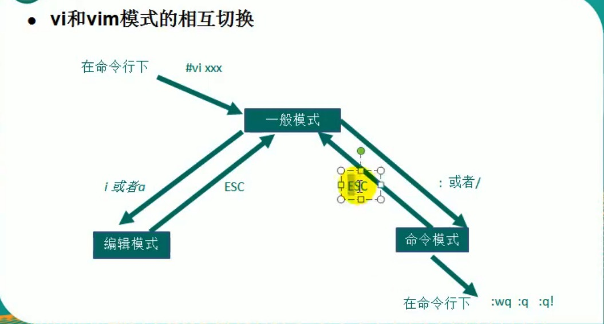

# 1. vi和vim编辑器

## 1.1 vi和vim介绍
所有Linux系统都会内建vi和vim文本编辑器。

Vim具有程序编辑的能力，是Vi的增强版本，都是文本编辑器。


## 1.2 vi和vim常用的3种模式


### 正常模式

```shell script
vim
```
以 vim 打开一个档案就直接进入一般模式了(默认模式)。

这个模式中，可以使用【上下左右】按键来移动光标，可以使用【删除字符】或【删除整行】来处理档案内容，也可以使用【复制、粘贴】来处理你的文件数据。


### 插入/编辑模式

```shell script
i
I
o
O
a
A
r
R
```

按下i、I、o、O、a、A、r、R等任何一个字母之后才会进入编辑模式，一般来说按 i 即可。


### 命令行模式

在这个模式中，可以提供你相关指令，完成读取、存盘、替换、离开vim、显示行号等的动作。


### vi模式相互切换




## 1.3 vim常用快捷键

### 1.复制当前行

光标移到这行中任意位置，一般模式下:

复制单行内容:
```shell script
yy
```

粘贴:

```shell script
p
```


### 2.复制光当前行下n行

光标移到这行中任意位置，一般模式下，复制光标(包含)所在的n行:

```shell script
n yy
```

粘贴:

```shell script
p
```

### 3.删除当前行

光标移到这行中任意位置，一般模式下:

```shell script
dd
```

### 4.删除当前行下n行

光标移到这行中任意位置，一般模式下，删除光标(包含)所在的n行:

```shell script
n dd
```

### 5.文件中查找某个单词

```shell script
/关键字
```

回车 查找，

输入 n: 下一个

```shell script
n
```

### 6.设置行号

一般模式下:

```shell script
:set nu
```

### 7.取消行号

一般模式下:

```shell script
:set nonu
```

### 8.到达文件最首行

一般模式下:

```shell script
gg
```


### 9.到达文件最末行

一般模式下:

```shell script
G
```

### 10.撤销上个动作

一般模式下:

```shell script
u
```

### 11.跳到第m行
一般模式下:

```shell script
m
```

然后: 

```shell script
shift+g
```

## 1.4 vim快捷键盘图


