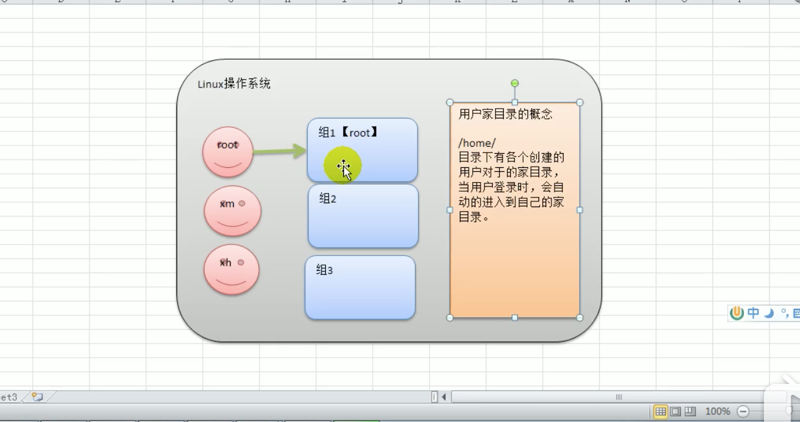

# 1. 创建用户


## 1.1 Linux用户基本介绍



Linux系统是一个多用户任务的操作系统，任何一个要使用系统资源的用户，都必须首先向系统管理员申请一个账号，然后以这个账号的身份进入系统。

Linux的用户至少要属于一个组。


## 1.2 创建用户

### 创建用户语法

```shell script
useradd [选项] 用户名
```

## 1.3 创建用户细节说明

* 当用户创建成功后，会自动创建和用户同名的家目录。

* 给新创建的用户指定家目录。

```shell script
useradd -d 指定目录 新的用户名;
```

* 如果没有给用户指定分组，那么会创建一个这个用户名的分组，该用户在这个分组中。
