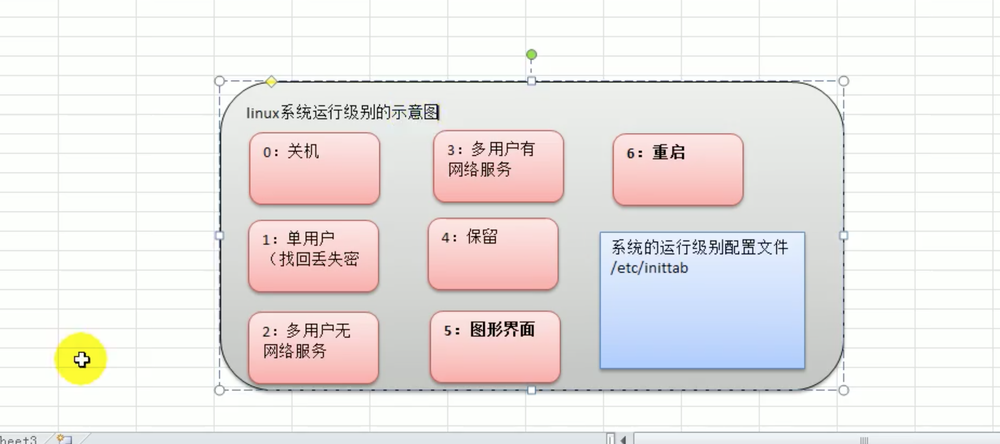
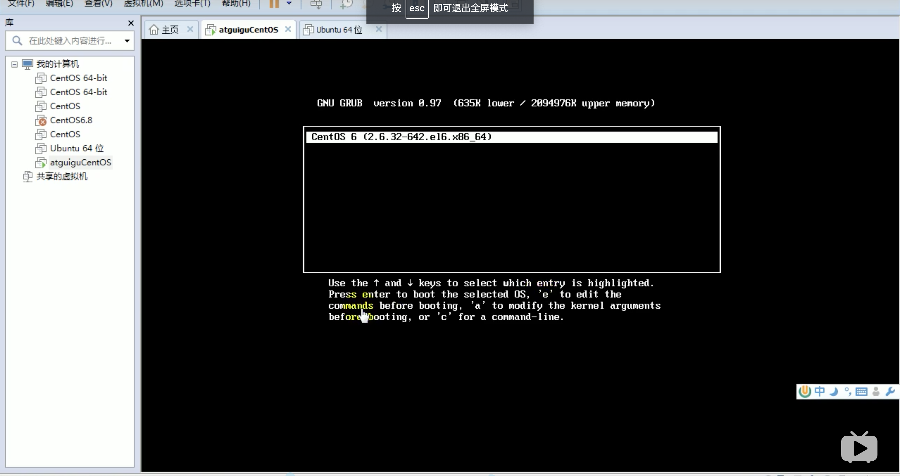
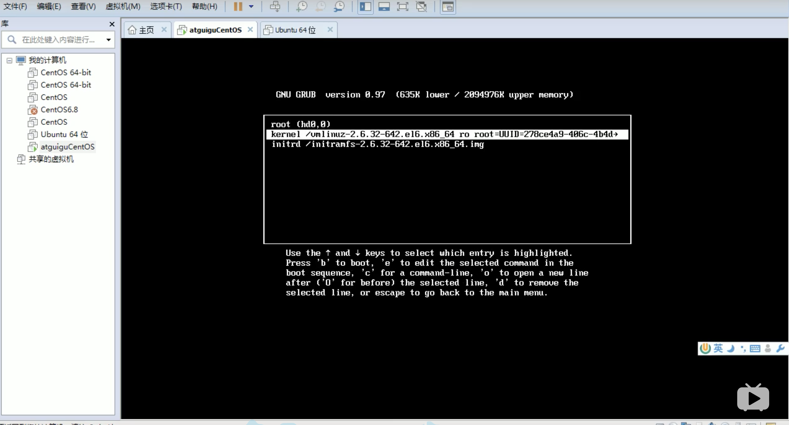
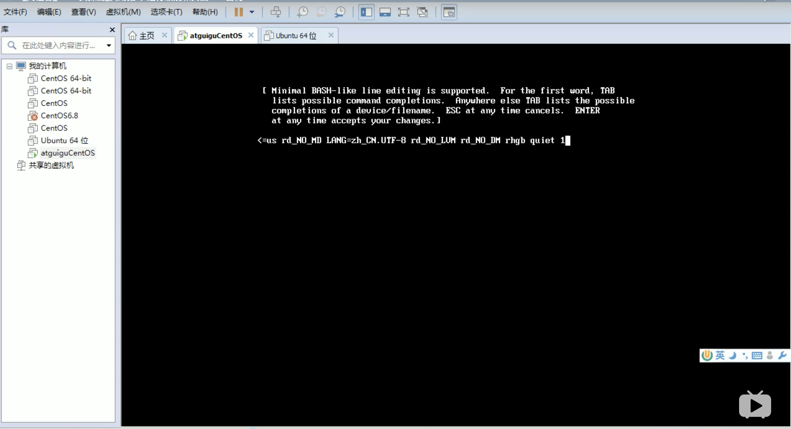
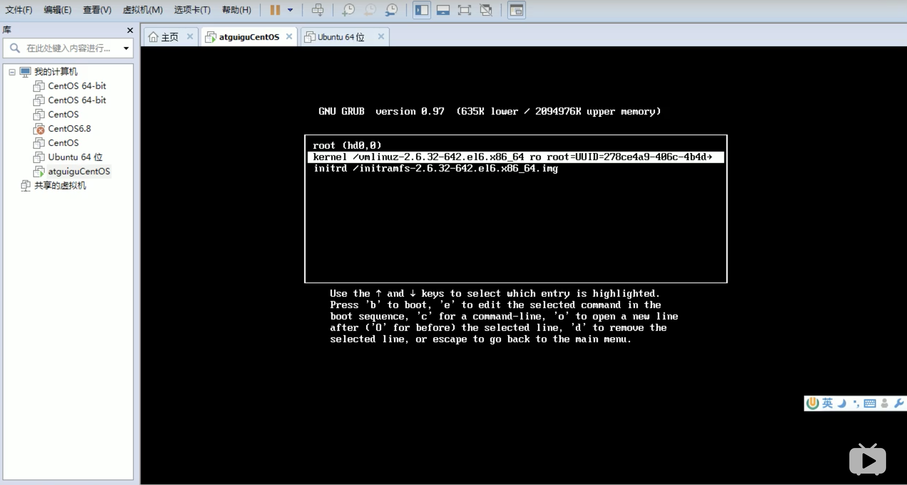
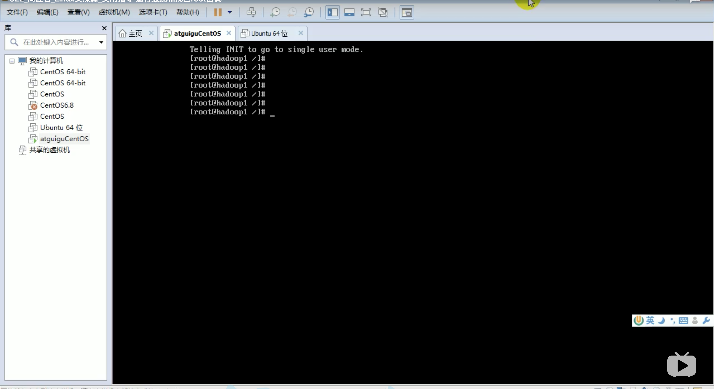

# 1. 运行级别

## 1.1 运行级别分类

* 0: 关机
* 1: 单用户(找回丢失密码)
>  单用户模式，root不需要密码就可以登录。

* 2: 多用户无网络服务
* 3: 多用户有网络服务(最常见)
* 4: 保留级别
* 5: 图形界面
* 6: 重启



系统的运行级别配置文件: /etc/inittab


## 1.2 指定运行级别

### 常用运行级别

常用的运行级别是3和5，要修改默认的运行级别可修改文件 /etc/inittab 中

```shell script
id:5:initdefault
```

这一行的数字。


### 指定运行级别语法

```
init [012356]
```

如: 通过init来切换不同的运行级别，比如5-3，然后关机

```shell script
init 3
init 0
```

## 1.3 面试题: 找回丢失的root密码

如果不小心忘记了root密码，如何找回？

思路: 进入到单用户模式，然后修改root密码。

* Step 1: 开机: 在引导时 输入回车键 ，看到如下界面1:




* Step 2: 看到界面1，输入e，看到如下界面2:




* Step 3: 选中第2行(编辑内核Kernel)，再输入e，看到如下界面3:



* Step 4: 在界面3，最后输入 1 ，再输入 回车键，看到如下界面4:



 
* Step 5: 再次输入 b，就会进入单用户模式，如下:



* Step 6: 进入单用户模式，使用 passwd 修改root密码


## 1.4 面试题: 设置Linux运行级别为3

修改默认的运行级别可修改文件 /etc/inittab 中

```shell script
id:3:initdefault
```
