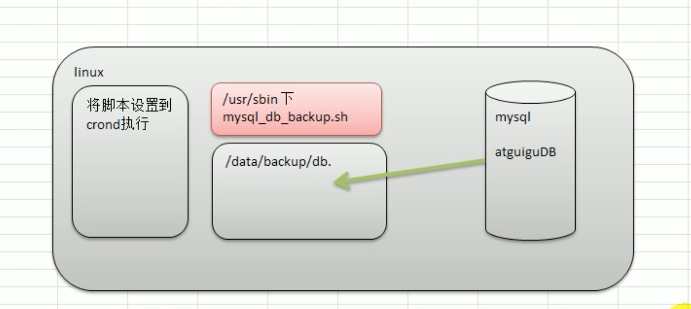

# 16. 定时维护数据库

## 16.1 需求分析
1.每天凌晨 2:10 备份数据库 atguiguDB 到 /data/backup/db
2.备份开始和备份结束能够给出相应的提示信息
3.备份后的文件要以备份时间为文件名，并打包成.tar.gz的形式，如: 2018_03_12_020100.tar.gz
4.在备份的同时，检查是否有10天前备份的数据库文件，如果有就将其删除


## 16.2 shell实现

### 1.编写 mysql_db_backup.sh



```shell script
cd /usr/sbin
vi mysql_db_backup.sh
```

```shell script
#!/bin/bash
#完成数据库的定时备份
#备份的路径
BACKUP=/data/backup/db
#当前时间名为文件名
DATETIME=$(date + "+%Y_%m_%d_%H%M%S")
#可以输出变量调试
echo "$DATETIME"
echo ${DATETIME}

echo "=========开始备份========="
echo "=========备份的路径是: $BACKUP/$DATETIME.tar.gz"

#主机
HOST=locahost
#用户名
DB_USER=root
#密码
DB_PWD=root
#备份数据库名
DATABASE=atguiguDB
#创建备份的路径
#如果备份的文件夹存在，就使用，否则就创建
[ ! -d "$BACKUP/$DATETIME" ] && mkdir -p "$BACKUP/$DATETIME" 

#执行数据库备份指令，放到临时目录
mysqldump -u${DB_USER} -P${DB_PWD} --host=$HOST $DATABASE | gzip > $BACKUP/$DATETIME/$DATETIME.sql.gz
#打包备份文件
cd $BACKUP
tar -zcvf $DATETIME.tar.gz $DATETIME
#删除临时目录
rm -rf $BACKUP/$DATETIME

#删除10天前的备份文件,rm -rf {} \ 删除找到的文件
find $BACKUP -mtime +10 -name ".tar.gz" -exec rm -rf {} \;
echo "=========备份成功========="
```

### 2.编写定时任务: crontab

```shell script
crontab -e
```

输入crontab里的内容:

```shell script
10 2 * * * /usr/sbin/mysql_db_backup.sh
```
